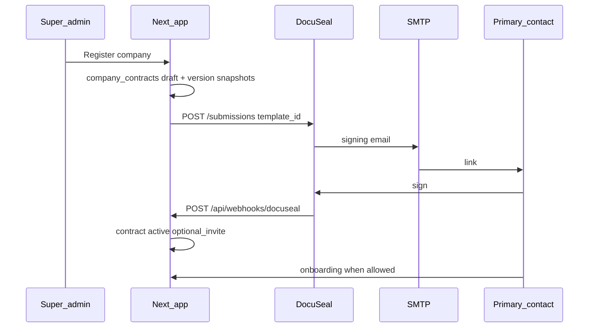

# Plan: E-sign, rental registration, and contract gating

> **Superseded (2026-07-15):** DocuSeal was **removed**. Use native RMS e-sign — [docs/esign.md](../esign.md) and [docs/PROGRESS.md](../PROGRESS.md). The content below is historical.

**Last updated:** 2026-07-15 (archived)  

---

## Goals

| # | Goal | Status |
|---|------|--------|
| 1 | Super-admin registers company with published T&C, commercial terms, pricing preset | Done |
| 2 | E-sign sends signing invite to primary contact (non-legacy) | In progress |
| 3 | Rental app gated until `company_contracts.status === 'active'` | Done |
| 4 | Optional early invite → `/rental/awaiting-contract` until signed | Done |

---

## Architecture (target flow)

**Two emails (do not confuse):**

- **Supabase Auth** — account invite / password setup  
- **DocuSeal SMTP** — sign the rental agreement  

---

## RMS integration (implemented)

| Piece | Path |
|-------|------|
| Send for signature | `apps/web/src/lib/docuseal/send-company-contract-for-signature.ts` |
| API client | `apps/web/src/lib/docuseal/client.ts` |
| Config / submission mode | `apps/web/src/lib/docuseal/config.ts` |
| HTML document builder (Pro API) | `apps/web/src/lib/docuseal/contract-signing-html.ts` |
| Webhook route | `apps/web/src/app/api/webhooks/docuseal/route.ts` |
| Webhook handler | `apps/web/src/lib/docuseal/webhook-handler.ts` |
| Register + auto-send | `apps/web/src/app/actions/admin-companies.ts` |
| Awaiting contract UI | `apps/web/src/app/(main)/rental/awaiting-contract/` |
| Gating | `apps/web/src/lib/auth/rental-lifecycle.ts`, `rental-contract-gate.ts` |

### DocuSeal API modes

| Mode | Env | Endpoint | Self-hosted OSS | Status |
|------|-----|----------|-----------------|--------|
| **template** (default) | `DOCUSEAL_CONTRACT_TEMPLATE_ID` | `POST /submissions` | Yes | **Use this** |
| **html** | `DOCUSEAL_CONTRACT_SUBMISSION_MODE=html` | `POST /submissions/html` | No (Pro) | Code ready; blocked on OSS |
| **pdf** | Not in RMS | `POST /submissions/pdf` | No (Pro) | Not implemented |

- Submitter role in RMS: **`First Party`** (must match template).  
- Legacy bootstrap: `RENTAL_CONTRACT_LEGACY_BOOTSTRAP_SIGNED=true` or no `DOCUSEAL_API_KEY`.

---

## Local DocuSeal (operational)

| Step | Status |
|------|--------|
| `docker compose up` in `infra/docuseal` | Done |
| Gmail SMTP in `infra/docuseal/.env` | Done |
| Admin + API key | Done (user) |
| Template + **First Party** role + template id in RMS | **Pending** |
| Settings → Webhooks → `host.docker.internal:3000/...` | Configured (verify E2E) |
| RMS `.env.local` + Next restart | Partial (restart after changes) |

Details: [infra/docuseal/README.md](../../infra/docuseal/README.md)

---

## Database

### Contract `status` values (after `ensure_company_contracts_status_check.sql`)

`draft`, `sent_for_signature`, `signed_by_customer`, `active`, `pending_amendment`, `suspended`, `terminated`, `expired`, `superseded`

**Legacy DB** only allowed: `active`, `pending_renewal`, `terminated` → breaks insert of `draft`.

### Manual scripts (remote Supabase)

| Script | Purpose |
|--------|---------|
| `ensure_company_contracts_status_check.sql` | Status check constraint |
| `ensure_company_contracts_commercial_columns.sql` | `billing_anchor_day`, etc. |
| `ensure_company_contract_versions_snapshot_columns.sql` | `commercial_snapshot`, `terms_snapshot` |
| `ensure_contract_pricing_snapshots.sql` | Pricing snapshots table + RLS |
| `ensure_contract_pricing_presets.sql` | Presets (if needed) |

**Preferred:** migration `20260403210000_rental_contract_billing_platform.sql` via `supabase db push`.

### Tables required for e-sign flow

`company_contracts`, `company_contract_versions`, `contract_signature_requests`, `contract_pricing_snapshots`

---

## Dynamic contracts (future / Pro)

Per-company document from `terms_snapshot` + `commercial_snapshot` + fixed signature fields.

| Approach | DocuSeal requirement |
|----------|----------------------|
| HTML API | Pro — `/submissions/html` |
| PDF API | Pro — `/submissions/pdf` |
| Template in UI | OSS — static PDF, not per-company HTML merge |

RMS already has `buildContractSigningHtmlDocument()` for when Pro or another renderer is available.

---

## Alternatives (cost: ~£0.20/document on DocuSeal cloud)

| Option | Cost | Effort | Fit |
|--------|------|--------|-----|
| **A. In-app signing** | No per-doc vendor fee | Medium–high | Full control; OTP + audit + `pdf-lib` |
| **B. Documenso** | Self-host OSS | Medium | Next.js ecosystem |
| **C. OpenSign** | Self-host OSS | Medium | Workflow product |
| **D. DocuSeal Pro** | Subscription / per-doc | Low | Keeps current code |
| **E. OSS template only** | Free self-host | Low | Same PDF for all companies until Pro or A |

**Recommendation if cost is unacceptable:** spike **Option A** while using **E** for short-term demos.

---

## Task board (sync with PROGRESS.md)

| ID | Task | Status |
|----|------|--------|
| docker-docuseal | Compose + SMTP | **done** |
| docuseal-api-key | API key in RMS `.env.local` | **done** (verify) |
| docuseal-template | Template **First Party** + `DOCUSEAL_CONTRACT_TEMPLATE_ID` | **pending** |
| webhook-config | Settings → Webhooks URL + events | **done** (verify E2E) |
| webhook-secret | Optional secret alignment | **pending verify** |
| rms-restart | Restart Next after `.env.local` | **pending** (after template id) |
| db-status-check | `ensure_company_contracts_status_check.sql` | **done** |
| db-remaining | Other `ensure_*` or full migration | **pending** |
| e2e-smoke | Email → sign → webhook → `active` | **pending** |
| vendor-decision | Pro vs in-app vs other OSS | **open** |

---

## Pitfalls

1. Restart Next after `.env.local` changes.  
2. Do not use cloud **Console** for webhooks on self-hosted `:8080`.  
3. HTML mode on OSS → Pro 404 (not a bug in RMS).  
4. Supabase invite ≠ DocuSeal signing email.  
5. Template PDF ≠ live terms HTML from catalog unless you merge via Pro or custom PDF generation.
