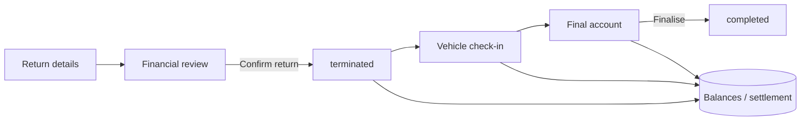

# End hire E2E — Hire #509cc528 (KE18FSX)

Living test case for the end-hire wizard, check-in damages, deposit resolution, and balance sheet.

**Spreadsheet:** [`hire-509cc528-end-hire-baseline.xlsx`](./hire-509cc528-end-hire-baseline.xlsx)  
**Re-export baseline:** `cd apps/web && node scripts/export-hire-end-hire-test-snapshot.mjs 509cc528`

| Field | Value |
| --- | --- |
| Hire ID | `509cc528-af57-4385-bcb8-ec795db1307a` |
| Short ID | `509cc528` |
| VRM | KE18FSX |
| Driver | mujtaba.ghulamfarooq@gmail.com |
| Status (baseline) | `active` |
| Activated | 23/08/2026 |

---

## Baseline account (before end hire)

### Rent schedule
See **Schedule** sheet in the workbook (deposit + weekly rent rows).

### Extra charges (at export)

| Description | Charged | Paid | Balance | Status |
| --- | ---: | ---: | ---: | --- |
| PCO help | £100 | £100 | £0 | Paid |
| PCN Challange | £30 | £30 | £0 | Paid |
| another PCN charge | £30 | £30 | £0 | Paid |
| Car wash (full valet) | £50 | £30 | **£20** | Partially paid |
| Window damage | £200 | £0 | £0 | **Voided** |
| PCN challange (new) | £30 | £0 | **£30** | Due |
| We paid for his PCN | £40 | £40 | £0 | Paid |

**Extras outstanding (approx):** £50 (£20 + £30)

### Balance payments (driver_charge receipts)
8 receipts totalling extra-charge collections — see **BalancePayments** sheet.

### Inspections
- Checkout: completed (23/08/2026)
- Check-in: not started yet

### Settlement (pre end-hire)
- `settlement_balance_gbp`: £0
- `deposit_disposition`: not set
- End hire draft: not started

---

## Wizard flow (reference)



1. **Return details** — date, time, reason  
2. **Financial review** — rent / deposit / extras; **Confirm return** terminates hire  
3. **Vehicle check-in** — add damages; choose **No charge (waived)**, **Add to balance**, or **Charged now**  
4. **Final account** — review open balance; resolve deposit; record settlement payments; **Finalise**

Deposit and final settlement are decided **after** check-in on Payments / Balances — not all on one wizard screen.

---

## Step-by-step test (fill Pass/Fail in Excel)

| Step | Phase | What to do | Expected |
| --- | --- | --- | --- |
| E2E-00 | Baseline | Open Payments & balance; compare to workbook | Matches baseline sheets |
| E2E-01 | Start | End hire → Start contract termination | Status `ending` |
| E2E-02 | Return | Enter return details → continue | Step → Financial review |
| E2E-03 | Financial review | Review cards; clear pending approvals if any | Clear rent/deposit/extras position |
| E2E-04 | Confirm return | Confirm return | `terminated`, settlement snapshot, on Balances |
| E2E-05 | Check-in | Add 2+ damages (mixed resolutions) | Waived / add_to_balance / paid_now behave correctly |
| E2E-06 | Check-in complete | Complete inspection → continue | Final account step |
| E2E-07 | Final account | Review KPIs; use Payments/Balances links | Full picture visible |
| E2E-08 | Deposit | Resolve deposit disposition | Recorded; balance updates |
| E2E-09 | Settlement | Record final payment/refund if needed | Open balance moves toward settled |
| E2E-10 | Finalise | Finalise contract termination | `completed` |
| E2E-11 | Verify | Company Balances + hire workspace | Final numbers match ExpectedOutcomes sheet |

---

## Check-in damage scenarios (suggested)

Record these in the **TestSteps** notes column as you go:

| # | Damage | Resolution | Expected on account |
| --- | --- | --- | --- |
| CI-1 | e.g. Scuffed alloy | **No charge (waived)** | Line `waived`; no settlement increase |
| CI-2 | e.g. Interior stain | **Add to balance** | New extra charge; increases driver owes |
| CI-3 | e.g. Missing hub cap | **Charged now** | Receipt + paid charge; no outstanding |

---

## Issues log (add as you test)

| # | Step | Issue | Severity | Notes |
| --- | --- | --- | --- | --- |
| | | | | |

---

## How to refresh baseline after changes

```bash
cd apps/web
node scripts/export-hire-end-hire-test-snapshot.mjs 509cc528
```

Updates CSVs and `hire-509cc528-end-hire-baseline.xlsx` without overwriting your Pass/Fail notes if you keep notes in a copy.
